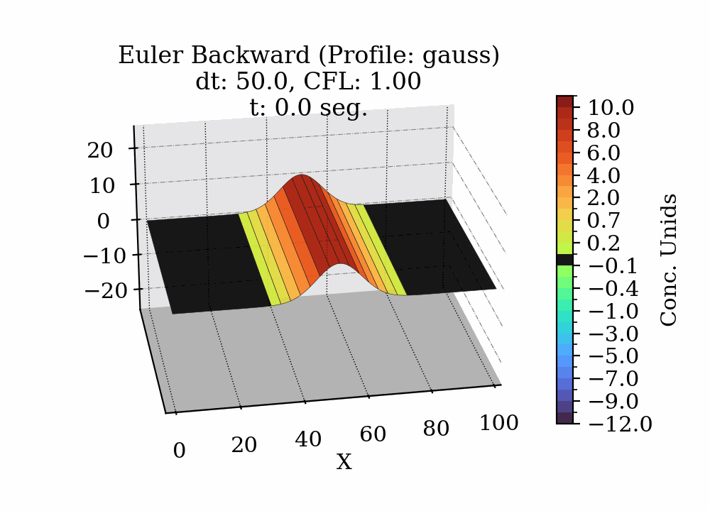
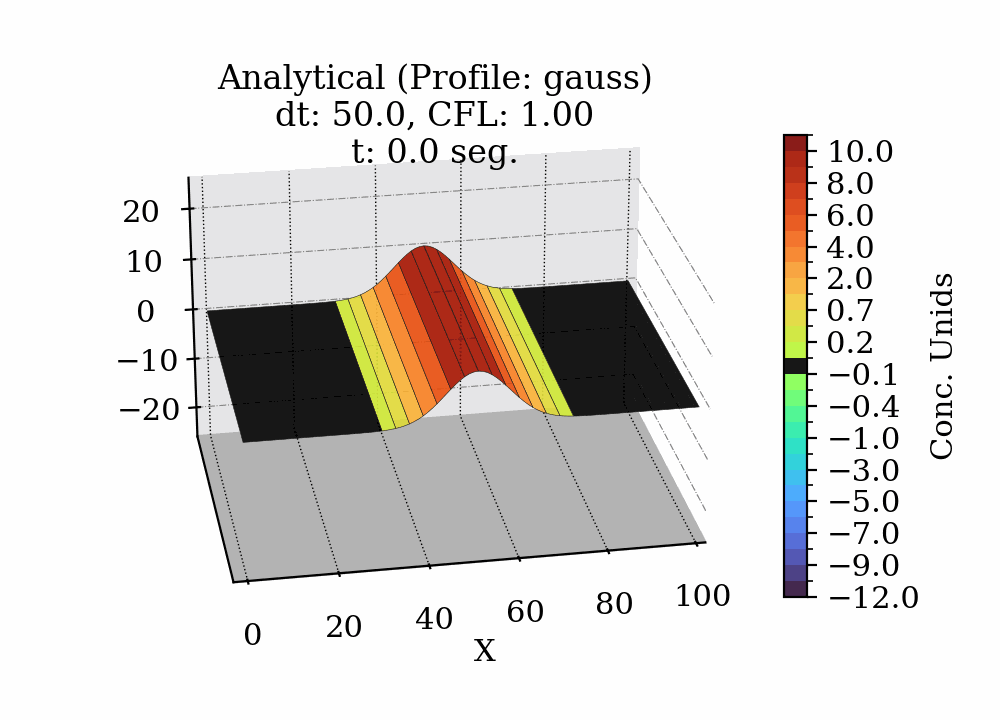

# atMOdel 
**Numerical Advection Model with Different Schemes**  
*Simulation of pollutant transport using numerical methods and 3D visualization.*

## 📋 Table of Contents  
1. [Description](#-description)  
2. [Project Structure](#-project-structure)  
3. [Requirements](#-requirements)  
4. [Installation](#-installation)  
5. [Usage](#-usage)  
6. [Examples](#-examples)  
7. [Results](#-results)  
8. [Testing](#-testing)  
9. [Contribution](#-contribution)  
10. [Technical Documentation](#-technical-documentation)  

## 🌟 Description  
This project simulates the transport of a pollutant in a one-dimensional flow using:  
- **Euler Backward Scheme** for time discretization.  
- **Periodic boundary conditions**.  
- Interactive visualization with `matplotlib` and `xarray`.  

**Applications**: Atmospheric modeling, pollutant dispersion, fluid dynamics.  

## 📂 Project Structure  
```plaintext
atMOdel/  
├── 📁 src/                   # Source code  
│   ├── physics.py         # Numerical functions (e.g., Euler backward)  
│   ├── data_handling.py   # NetCDF data loading, saving, and metadata  
│   ├── visualization.py   # 3D and surface plotting functions  
│   └── main.py            # Base simulation example (single run)  
├── 📜 p01_run_simulation.py  # Launches main simulation  
├── 📜 p02_generate_plots.py  # Generates static plots  
├── 📜 p03_make_animation.py  # Creates GIF animations  
├── 📜 requirements.txt       # Dependencies  
├── 📁 outputs/               # Generated results  
│   ├── animations/           # Time evolution GIFs  
│   ├── data/                 # NetCDF data (*.nc)  
│   ├── figures/              # Static figures (PNG)  
├── 📁 docs/                  # Technical documentation  
│   ├── 📖 01_Introduction.md  
│   ├── 📖 02_Equation.md  
│   ├── 📖 03_Methods.md  
│   ├── 📖 04_Stability.md  
│   ├── 📖 05_Experiments.md  
│   └── 📖 06_Referenc.md  
├── 📜 requirements.txt       # List of dependencies  
├── 📜 README.md              # Project presentation document  
└── 📜 .gitignore             # Git ignored files  
```

## 🛠️ Requirements  
- **Python 3.8+**  
- Libraries (see `requirements.txt`):  
```plaintext
numpy>=1.21.0
xarray>=0.20.0
matplotlib>=3.5.0
pandas>=1.3.0
pillow>=9.0.0
```

## ⚙️ Installation  
1. Clone the repository:  
```bash
git clone https://github.com/your-username/atMOdel.git
cd atMOdel
```  
2. Install dependencies:  
```bash
pip install -r requirements.txt
```

## 🚀 Usage  
### Basic setup  
Scripts accept key parameters to customize the simulation:  
- `--dt`: Time step (default: `40`)  
- `--nr`: Gaussian width (default: `10`)  
- `--profile`: Initial profile (`gauss` or `rectg`, default: `gauss`)  

---
1. **Run simulation**     
   ```bash
   python p01_run_simulation.py --method "Euler Backward" --dt 30 --profile gauss --nr 10
   ```  
   *Generates NetCDF files in `outputs/data/`*  

2. **Generate static plots**  
   ```bash
   # For numerical results:
   python p02_generate_plots.py --numerical "Euler Backward" --dt 30 --profile gauss --nr 10

   # For analytical solution:
   python p02_generate_plots.py --analytical "Euler Backward" --dt 30 --profile gauss --nr 10
   ```  
   *Saves images in `outputs/figures/`*  

3. **Create animation**
   ```bash
   python p03_make_animation.py --numerical "Euler Backward" --dt 30 --profile gauss --nr 10 --engine imagemagick
   ```
   *Generates GIF in `outputs/animations/`* using ImageMagick 
   ```bash
   python p03_make_animation.py --analytical "Euler Backward" --dt 30 --profile gauss --nr 10
   ```  
   *Generates GIF in `outputs/animations/`* using PIL

4. **example**




---

## 📌 Key Parameters  
| Parameter      | Description                          | Typical values             |  
|----------------|--------------------------------------|----------------------------|  
| `--method`     | Numerical scheme (`Euler Backward`,`LFo2`,`LFo4`, etc)  | `"Euler Backward"`         |  
| `--dt`         | Time step (seconds)                  | `30`, `40`, `60`, etc      |  
| `--profile`    | Initial profile                      | `gauss` or `rectg`         |  
| `--nr`         | Gaussian width                       | `2` (narrow), `10` (wide)  |  

## 📊 Examples  
### 1. Basic simulation:  
```python
from physics import gauss, euler_backward_step  
Cn = [gauss(x, 0, nr=10, u=10, dx=500, Nx=101) for x in range(101)]  
Cnp1 = euler_backward_step(Cn, u=10, dt=60, dx=500, Nx=101)  
```

### 2. 3D visualization:  
```python
from visualization import plot_3d_surface  
plot_3d_surface(dataset, method="Euler Backward", ti=115, dt=60, CFL=1.2)  
```

## 📌 Results  
- NetCDF output with pollutant time evolution:  
  `outputs/data/*.nc`
- 3D graphs automatically generated at each time step:  
  `outputs/figures/EulerBackward/*.png`
- `.gif` animation of the pollutant evolution:  
  `outputs/figures/*.gif`

## ⚙️ Advanced Configuration  
Modify directly in the scripts:  
```python
# p01_run_simulation.py
u = 10      # Velocity (m/s)  
Nx = 101    # Spatial points  
dx = 500    # Resolution (m)  
```
## 🧪 Testing  
To run unit tests:  
```bash
pip install -e .
pytest tests/
```  
Includes tests for modules:  
- `data_handling.py`  
- `physics.py`  
- `visualization.py`

### **Interactive Notebooks**  
Explore step-by-step calculations and debugging in these Jupyter notebooks:  
1. **`tests/dataset_view.ipynb`**:  
   - Visual inspection of dataset structure.  
   - Examples of data slicing and basic plotting.  

2. **`tests/Euler_Backward.ipynb`**:  
   - Detailed derivation of the Euler Backward scheme.  
   - ... >_< ire agregando los demas metodos 

## 🤝 Contribution  
- https://chat.deepseek.com  
- https://chatgpt.com  

## 📖 Technical Documentation  
The [`docs/`](docs/) directory contains detailed project documentation, including:

- `01_Introduction.md`: Fundamentals of the advection model and its relevance in atmospheric sciences.  
- `02_Equation.md`: Description of the 1D advection equation, initial and boundary conditions.  
- `03_Methods.md`: Implemented numerical methods: Euler Backward, Leapfrog, RK4, etc.  
- `04_Stability.md`: Stability criteria, CFL number, and Von Neumann analysis.  
- `05_Experiments.md`: Simulation configurations, testing conditions, and evaluation criteria.  
- `06_Referenc.md`: Scientific bibliography used (APA7 format).

## ✉️ Contact  
Questions? Open an *issue* or contact [@Japq91](https://github.com/Japq91).
