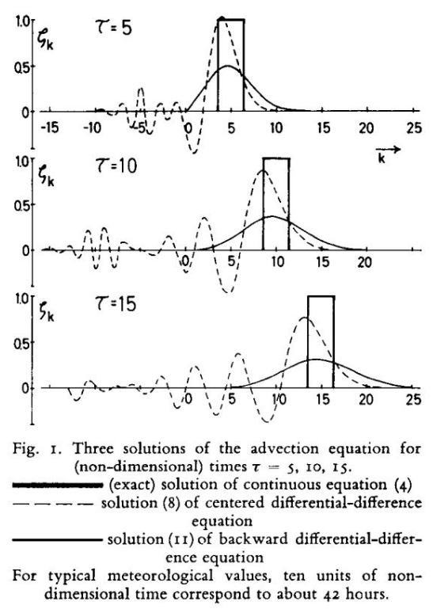

# Numerical Methods Implemented

This section describes the numerical schemes applied to solve the 1D advection equation:

    ∂C/∂t + U ∂C/∂x = 0

Each method has different stability conditions, accuracy orders, and implementation characteristics. The schemes were based on formulations from Doös et al. (2022).

---

## 1. Euler Backward (First-Order, Implicit)

    C_j^{n+1} = C_j^n - (U * Δt / Δx) * (C_j^n - C_{j-1}^n)

- Explicit method (unconditionally stable for CFL ≤ 1, unconditionally unstable for CFL > 1)
- First-order accurate in time: O(Δt)
- Adds numerical diffusion

---

## 2. Leapfrog (Second-Order, Explicit)

    C_j^{n+1} = C_j^{n-1} - (U * Δt / Δx) * (C_{j+1}^n - C_{j-1}^n)

- Explicit method, conditionally stable for CFL ≤ 1
- Second-order in time: O(Δt²)
- No dissipation but introduces phase errors and dispersion

---
### Oscillation Behavior in Leapfrog Method

The tendency of Leapfrog to develop oscillations at CFL < 1 is illustrated in Figure 3, based on Randall (2021).

---

## 3. Leapfrog with Fourth-Order Derivative (Explicit)

    C_j^{n+1} = C_j^{n-1} - (U * Δt / (12Δx)) * (-C_{j+2} + 8C_{j+1} - 8C_{j-1} + C_{j-2})

- High-order derivative to reduce dispersion errors
- Requires smaller time step for stability: CFL ≤ 0.729
- More accurate for smooth fields, sensitive to boundaries

---

## 4. Matsuno Predictor-Corrector (First-Order, Explicit)

**Predictor:**

    C*_j = C_j^n - (U * Δt / Δx) * (C_{j+1}^n - C_j^n)

**Corrector:**

    C_j^{n+1} = C_j^n - (U * Δt / Δx) * (C*_{j+1} - C*_{j-1})

- Two-step method
- First-order accurate in time: O(Δt)
- Simple but introduces damping

---

## 5. Crank-Nicholson (Second-Order, Implicit)

    C_j^{n+1} = C_j^n + (Δt / 2) * [f(C_j^n) + f(C_j^{n+1})]

- Implicit method
- Second-order in time: O(Δt²)
- Stable for large CFL, but may suffer from phase errors

---

## 6. Runge-Kutta 4th Order (Explicit)

Combines four intermediate steps:

1. Predictor (Euler):

       k1 = f(C^n)

2. Midpoint estimates:

       k2 = f(C^n + 0.5Δt * k1)
       k3 = f(C^n + 0.5Δt * k2)

3. Final step:

       k4 = f(C^n + Δt * k3)
       C^{n+1} = C^n + (Δt / 6) * (k1 + 2k2 + 2k3 + k4)

- High accuracy: O(Δt⁴)
- Good for problems where precision is more important than cost
- Requires careful step size selection for stability

