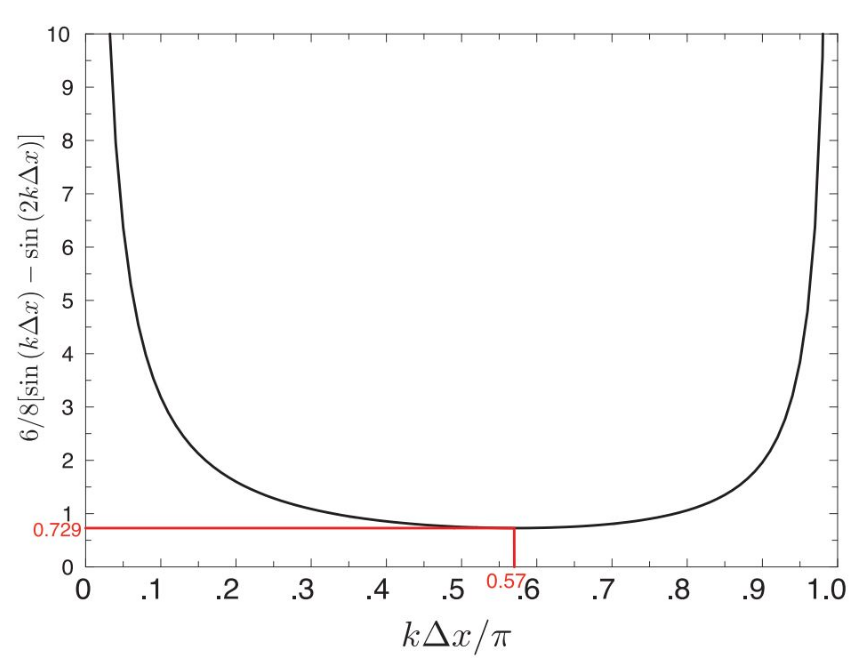
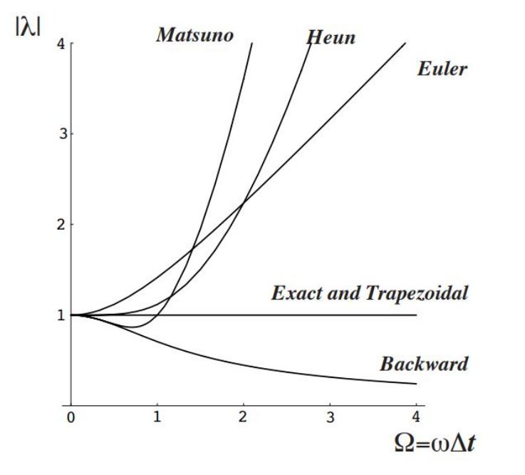

# Stability Criteria and CFL Condition

Numerical stability is a critical aspect when solving time-dependent partial differential equations. For the 1D advection equation:

    ∂C/∂t + U ∂C/∂x = 0

stability depends on the relationship between the time step (Δt), grid spacing (Δx), and advection velocity (U). This relationship is quantified by the Courant-Friedrichs-Lewy (CFL) number.

---

## Courant-Friedrichs-Lewy (CFL) Number

The CFL number is defined as:

    CFL = U * Δt / Δx

Where:
- `U` is the advection speed
- `Δt` is the time step
- `Δx` is the spatial grid spacing

The CFL condition ensures that numerical information propagates within one grid cell per time step, which is necessary for stability in explicit schemes.

---

## CFL Stability Thresholds by Method

| Method                    | Stability Limit          |
|--------------------------|--------------------------|
| Euler Backward (implicit)| CFL ≤ 1 (stable if small)|
| Leapfrog (2nd-order)     | CFL ≤ 1                  |
| Leapfrog + 4th-order     | CFL ≤ 0.729              |
| Matsuno                  | CFL ≤ 1                  |
| Crank-Nicholson          | Unconditionally stable   |
| Runge-Kutta 4th-order    | CFL depends on resolution|

> Note: Even stable methods can suffer from numerical dispersion or phase errors when the CFL approaches the upper limit.

---

## Practical Recommendations
- Use **CFL < 1** for all explicit methods unless the scheme is proven stable for higher values.
- For higher-order methods (e.g., 4th-order Leapfrog), reduce `Δt` or increase `Δx` to satisfy the stricter CFL constraint.
- Implicit methods allow for larger CFL, but may introduce damping or phase shift.

---
### Stability Criterion for Leapfrog Fourth-Order

The theoretical stability limit for the fourth-order Leapfrog scheme is highlighted (Doös, 2022).

---

## Von Neumann Stability Analysis (Brief)
Stability can be formally analyzed via a Von Neumann analysis, which studies how errors evolve in time by examining the amplification factor (λ):

    |λ| ≤ 1  →  Stable

Each numerical scheme has a characteristic λ as a function of wave number and CFL. For example, in Euler Backward:

    λ = 1 / (1 - iΩ)     where Ω = ω * Δt

which implies:

    |λ| = 1 / sqrt(1 + Ω²) < 1

This guarantees damping (dissipative behavior) and hence stability, at the cost of amplitude loss.

---
### Amplification Factor Behavior Across Schemes

Randall (2021) compares the amplification factors of several numerical methods, showing how some schemes preserve or dissipate wave amplitudes.

---

Always check the CFL value **before running simulations** to ensure your scheme operates within a stable regime.

